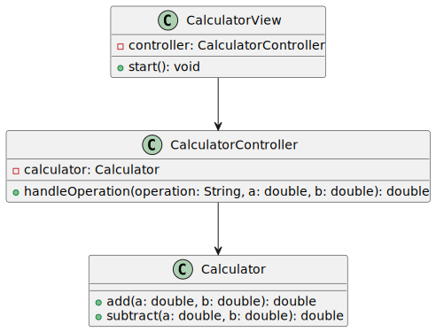

# 🧮 Calculadora em Java

Bem-vindo ao projeto **Calculadora em Java**! Este é um projeto simples que utiliza o padrão **MVC** (Model-View-Controller) e segue práticas de **TDD** (Test-Driven Development). 🚀

---

## ✨ Funcionalidades Atuais

- ✅ **Adição** de dois números.
- ✅ **Subtração** de dois números.
- 🚧 **Multiplicação** e **Divisão** (em desenvolvimento).
- 🚧 Tratamento de erros para divisão por zero.

---

## 🗂️ Arquitetura MVC

O projeto segue o padrão **MVC** para organizar o código:

- **View**: Responsável pela interação com o usuário (ex.: entrada e saída no console).
- **Controller**: Faz a ponte entre a View e o Model, processando as entradas e retornando os resultados.
- **Model**: Contém a lógica de negócios (ex.: operações matemáticas).

### 📊 Diagrama MVC

```plaintext
+------------------+       +----------------------+       +---------------------+
|  CalculatorView  |       | CalculatorController |       |     Calculator      |
|      View        | <-->  |      Controller      | <-->  |        Model        |
|   (Interface)    |       |  (Processa lógica)   |       | (Lógica de Negócio) |
+------------------+       +----------------------+       +---------------------+
```

### 📊 Diagrama de Classes




Para mais detalhes sobre o padrão **MVC**, confira este [artigo explicativo](https://medium.com/@robson.trasel/desvendando-o-padr%C3%A3o-mvc-em-java-um-guia-did%C3%A1tico-com-exemplos-ca1ba487f5fb). 📖

---

## 🚀 Como Executar o Programa

1. Certifique-se de ter o **Java 21** e o **Maven** instalados.
2. Clone este repositório:
   ```bash
   git clone https://github.com/svapollo/calculadora-java.git
   ```
3. Navegue até o diretório do projeto:
   ```bash
   cd calculadora-java
   ```
4. Compile e execute o programa:
   ```bash
   mvn compile exec:java -Dexec.mainClass="org.example.Main"
   ```

---

## 🧪 Como Rodar os Testes

1. Para executar os testes,  use o comando:
   ```bash
   mvn test
   ```
2. Os testes seguem os padrões **Given-When-Then** e **Arrange-Act-Assert**. Para mais informações, confira:
    - [TDD: O que é e como funciona](https://www.youtube.com/watch?v=o_C_qxhPws4) 🎥
    - [Given-When-Then e Arrange-Act-Assert](https://medium.com/@matheus.saraujo/testes-give-when-then-3bf3fef55f5e) 📄

---

## 🛠️ Próximos Passos

- 🔄 **Implementar**:
    - Multiplicação e divisão.
    - Tratamento de erro para divisão por zero.
- ✅ **Testes** para as novas funcionalidades.
- ⚙️ **Preparar para deploy**:
    - Pipeline de CI/CD.
    - Infraestrutura como código (IaC) com Terraform para deploy como AWS Lambda.
- 📈 **Observabilidade**:
    - Integração com Datadog para monitoramento.

---

💡 **Dica**: Este projeto é uma ótima oportunidade para aprender sobre **MVC**, **TDD** e boas práticas de desenvolvimento em Java.  
😄   Fique à vontade para contribuir! Pull requests são bem-vindos. 